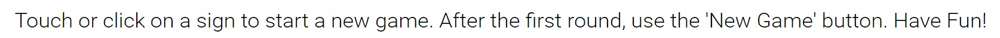

## Table of Contents
* [Purpose](#Purpose)
* [User Experience Design (UX)](#User-Experience-Design)
  * [User stories](#User-Stories)
    * [First Time Visitor Goals](#First-Time-Visitor-Goals)
    * [Returning Visitor Goals](#Returning-Visitor-Goals)
  * [Structure](#Structure)
  * [Design](#Design)
    * [Colour Scheme](#Colour-Scheme)
    * [Typography](#Typography)
    * [Imagery](#Imagery)
    * [Wireframes](#Wireframes)
    * [Differences to Design](Differences-to-Design)
* [Limitations](#Limitations)
- [Features](#Features)
    * [Existing Features](#Existing-Features)
    * [Future Features](#Features-Left-to-Implement)
* [Technologies](#Technologies)
* [Testing](#Testing)
    * [Test Strategy](#Test-Strategy)
      * [Summary](#Summary)
    * [Test Results](#Test-Results)
    * [Testing Issues](#Issues-and-Resolutions-to-issues-found-during-testing)
* [Deployment](#Deployment)
    * [Project Creation](#Project-Creation)
    * [GitHub Pages](#Using-Github-Pages)
    * [Locally](Run-Locally)
* [Credits](#Credits)
  * [Content](#Content)
  * [Media](#Media)
  * [Acknowledgements](#Acknowledgements)
  * [Comments](#Comments)

# Milestone Project 2
## Purpose
The website offers visitors the possibility to play the so-called "Rock Paper Scissors Lizard Spock". At the same time, it has been created for the sole purpose of completing the second Milestone Project for the Code Institute's Full Stack Developer course.
The knowledge gained from the HTML, CSS, User Centric Design, and Java Script Essentials modules played a key role in developing the interactive web page. A full list of the additional technologies can be found in the technologies section of this document.

The live website can be found [here](https://aelfrith92.github.io/rockPaperScissorsLizardSpock/).

## Rock Paper Scissors Lizard Spock (RPSLS) - Responsive and interactive game

Rock Paper Scissors Lizard Spock is an extension of the classic game of chance, Rock Paper Scissors, created by Sam Kass and Karen Bryla. Rock Paper Scissors Lizard Spock was first mentioned in the Season 2 episode, The Lizard-Spock Expansion, the title of which references the game. It was last mentioned in The Rothman Disintegration. Source: https://the-big-bang-theory.com/rock-paper-scissors-lizard-spock/

This website aims to reproduce the game, alongside a certain extent of customization, namely, options concerning enhanced difficulty and the number of attempts/throws per round. There is no profit purpose behind this web page. The user is offered with an essential UI and is able to interact since the very beginning. The responsiveness has been designed by considering the overall experience and the actual gameplay/playability.

*** 
## User Experience Design

### User stories
#### First Time Visitor Goals
* As a First Time user, I want to easily understand the main purpose of the site.
* As a First Time user, I want to be able to easily understand the game purpose and find instructions about it.
* As a First Time user, I want to start playing as soon as the UI is ready.
* As a First Time user, I want to edit the difficulty of the game and make it last (slightly) longer.
* As a First Time user, I want to view the website and the content clearly on my mobile device.
* As a First Time user, I want to find details about the author and its presence online.
#### Returning and Frequent Visitor Goals
* As a Returning and Frequent user, I want to share the content with friends.
#### Frequent Visitor Goals
* As a Frequent user, I want to feel confident about the game.
* As a Frequent user, I want to play, without streaming an excessive amount of data.
* As a Frequent user, I want to play fast and smooth. without lags or accessibility defects affecting the overall experience.
### Features
The site contains one single, interactive page.

As showed in the multi-device mockup above, the visible interface contains all the essential elements which would let the user:
* play,
  >  "I want to easily understand the main purpose of the site."
* have a visual/graphic explanation of the rules,
  >  "I want to be able to easily understand the game purpose and find instructions about it."
* choose their sign to begin the round,
  > "I want to start playing as soon as the UI is ready."
* change the difficulty and the number of throws.
  >  "I want to edit the difficulty of the game and make it last (slightly) longer."

The title of the webpage is presented at the top, emphasized by both the tab title and the related favicon. Pictures and icons showed within the page are free-to-use and their source is indicated in the following paragraphs. No attribution is required. The formats of the graphic resources have been thoroughly selected to improve data streaming, manipulation, and quality.
> "I want to play, without streaming an excessive amount of data."

Custom CSS allowed to make the Website responsive by the use of media queries and flexboxes CSS properties. There are three layout breakpoints, which trigger alternative views of contents and enhance the UX - with tiny and subtle details.
> "I want to view the website and the content clearly on my mobile device."

Images have been manipulated via SVG editors (GIMP, Atom, but also HTML source code, JS DOM manipulation) and included in the code so that they are accessible and light, in terms of data streaming and performance. Heights and widths are completely responsive, no fixed values have been assigned to the respective attributes to make them scale together with the viewport.

The main page also comprises features in regard to messages and notes returned to the user as they play, like, 
* a straight-to-the-point explanation about HOW-TOs at the top, below the title,
* updates about the user's and the computer picks,
* a short explanation of the customization and how to achieve it,
* highlighted parts of the text which return the user's customised options,
* the default options of the game, which will turn into constant updates about the winner of single throws, as well as of the round.
  > "I want to feel confident about the game."

The main page will contain a Footer Element with Social Media Icons. The icons used will be
from fontawesome. These are referenced below in the Frameworks-Libraries-and-Programs-Used section of this document. 
The aim of the Footer element is to fulfill the aforementioned user's stories:
> "I want to find details about the author and its presence online."  
> "I want to share the content with friends." 
 
#### Existing Features
- The title
  
- The subtitle at the top toggles in-between rounds
  
- Each section is responsive
  
- Buttons are set to a disabled status, depending on their function and the overall UX during the game
  
- Buttons are presented with an alternated colour pattern
  
- Sign/command buttons have a predominant presence on the page
  
- The 'New Game' button appears after the first round only and it is toggled in-between rounds. The paragraph next to it contains the current customization parameters, in bold for convenience.
	
- Updates regarding the ongoing round are returned constantly. The user can read what they and the computer have picked, as well as who wins the single throw or the whole round. The present tense is used to communicate the winner of the single throw, while the present perfect is employed for the winner of the round.
  
- Scores
  
- Instructions
  
- A footer containing social media icons that redirect users to the author's online presence
  > "I want to find details about the author and its presence online."
  
- Hovering and active effects on buttons
- DOM manipulation which allows to accomplish a number of tasks, like
* * The hovering and disabling toggles in regard to buttons. SVG files in particular cannot be easily styled via CSS; for this reason, DOM manipulation is necessary to alter, say, the stroke width or the stroke colour, inside the path tag;
  * The association of event listeners to the elements, to trigger certain behaviors when a certain situation occurs;
  * The content manipulation according to the user's actions.

#### Features Left to Implement
Code optimization has returned excellent results in terms of deleted-lines-of-codes. However, the js file still offers room for further improvements. After having shortened 2 functions, by successfully employing template literals, I have identified a pattern which would have granted a more automated way of running the function called whoWins, which currently contains a switch. Before this function, I was able to get rid of unnecessary long controls and I have replaced them with a few lines of codes. As soon as I started thinking about the algorithm behind whoWins and the rules of the game at large, I then came to the following conclusion left to implement with template literals:
* to determine who is the winner, it is necessary to get into the function 'what' was and 'who' played, i.e. paper and user;
* the variables passed through the function do not need to be explicit/clear, because they all observe a specific behaviour. Assuming that the signs are presented in the order RPSLS in an array, regardless of which is the first or the last sign (shifting and unshifting the order and putting the removed element on the opposite side of the array still works fine), indexes behave regularly:
  * behaviour: any sign in the array wins over the sign next to the one picked OR the one +3 positions in the same array. If the position falls outside the array, the count just goes back to the initial index.
  * for example, following the hypothetical array['R','P','S','L','S'], the computerPick[y] is Spock, the userPick[x] is Paper, the user wins because y = x+3;
  * the challenge: I have tried to re-create this behaviour in a few attempts and for the time being the priority is the submission.
 
Last but not least, event listeners regarding touching behaviours.

### Design
#### Colour Palette
The main colours used have been mainly inspired by the right balance of contrast, to make them acceptable for visually-impaired users.
#### Typography
Two main font families:
- the **nunito** font for the title, scores, and buttons;
- the **Roboto** font for the rest. 
Fonts have been imported from Google Fonts website, using the @import instruction at the top of the custom style.css file.
#### Imagery
* The SVG image depicting the rules and employed as favicon has been retrieved from [Wikipedia](https://en.wiktionary.org/wiki/rock-paper-scissors-lizard-Spock#/media/File:Pierre_ciseaux_feuille_l%C3%A9zard_spock_aligned.svg), free-to-use;
* The SVG images that can be seen both in the command buttons and as bullet points in the instructions area have been retrieved on [GitHub](https://github.com/JLChamberlain/RPSLS/tree/master/IMG/SVG). No indication about use and licence were found at the time of the visit: 20/01/2022. 

Social media icons in the footer come from font awesome.

#### Wireframes
 
I have drafted sections and content on a paper sheet and then I have developed the actual content by employing the following layout stratgies:
- Custom CSS;
- [Flexbox responsivness](https://www.w3schools.com/css/css3_flexbox_responsive.asp).

Before adding content in each section, I firstly assigned different background colours to the containers, to observe their behaviour, as well as layout. Once met my expectations, I added the content inside.

### Limitations
Some features of the SVG files could not be styles with CSS. JS DOM manipulation did the job instead.
***

## Technologies

* HTML
  - This project uses HTML as the main language to complete the structure of the Website.
* CSS
  - This project uses custom written CSS to style the Website.
* [Font Awesome](https://fontawesome.com/)
  - Font awesome Icons are used for the Social media links contained in the Footer section of the website.
* [Google Fonts](https://fonts.google.com/)
  - Google fonts are used throughout the project to import the aforementioned fonts, with specific font-sizes, through the @import instruction at the top of the custom CSS file.
* [Replit](https://replit.com/@FredM2)
  - **Replit is the Integrated Development Environment used to develop the Website. After the first commit via gitHub, the following ones have been triggered via Replit shell. As for permissions, gitHub only required to generate a token to push, which I have stored locally in the "Secrets (Environmental Variables)" area. FredM2 is my username and Replit signature.**
* [GitHub](https://github.com/aelfrith92)
  - GithHub is the hosting site used to store the source code for the Website and [Git Pages](https://pages.github.com/) is used for the deployment of the live site.
* [Git](https://git-scm.com/)
  - Git is used as version control software to commit and push code to the GitHub repository via Replit, where the source code is stored.
* [GIMP](https://www.gimp.org/)
  - Gimp is used to convert, scale, and reduce the file sizes of images before being deployed to reduce storage and bandwidth.
* [Google Chrome Developer Tools](https://developers.google.com/web/tools/chrome-devtools)
  - Google chrome built-in developer tools are used to inspect page elements and help debug issues with the site layout and test different CSS styles. In particular, it came handy when troubleshooting layout and boxes. For this project involving JS, it turned beneficial to debug the algorithm, when this did not meet my expectations. The most efficient way to get through all bugs consisted in inserting 'console.log' spies into each piece of code under investigation, to understand the variables course of action. Troubleshooting the code was a considerable part of this project. A few major bugs and related fixes regarded:
  - forgetting to assign an index to variables that were actually arrays (like 'classList' or those returned by functions methods like .split());
  - not considering data types when combining variables;
  - syntax errors;
  - logic-related mistakes;
  - trying to manipulate 'undefined's.
* [Mentor's read.me template](https://github.com/Daisy-McG/MilestoneProject-1/blob/master/README.md)
  - This read.me file has been drafted following the advice returned by the mentor, as well as following suggestions released on the course modules.
***
## Testing

### Test Strategy 

#### Summary 

Testing is required on MilestoneProject-2

- As mentioned above, Chrome dev tools played a crucial role in testing and debugging unexpected behaviours, deriving from JS DOM manipulation and logic behind it.
- Testing to be done on at least three web browsers (Google Chrome, Apple Safari, Mozilla Firefox) and all screen sizes.

- No elements should overlap another container div.

- All links to external websites must open in a new browser.

- Code validation tools for [HTML](https://validator.w3.org/), [CSS](https://jigsaw.w3.org/css-validator/), [JS1](https://beautifytools.com/javascript-validator.php), [JS2](https://codebeautify.org/jsvalidate), [JS3](https://jshint.com/)

- [Lighthouse](https://developers.google.com/web/tools/lighthouse) tool by Google Chrome

- [Wave](https://wave.webaim.org/) - Google Chrome plug-in to test common code errors and warnings, which encompass accessibility features and best practices.

- The live Project can be found [here](https://aelfrith92.github.io/rockPaperScissorsLizardSpock/).

### Test Results
- The images, custom layouts, button behaviours, JS DOM manipulation behaved as expected on 3 different browsers.
- No overlapping detected.
- External links behave as expected.
- DOM manipulation correctly works thanks to correct classes and IDs assigned to all elements
- Code validation returned no errors, however, JS Hint returned 50+ warnings about JS ES6 and its compatibility with older browsers
- Lighthouse returned the following outcome
    
- Wave returned the following outcome
  
  The only 2 alerts returned concerned the too-small texts at the bottom of the page, which I have not changed, as it is meant as secondary content for other targets, aware of such formalities

### Issues and Resolutions to issues found during testing
For this project involving JS, debugging the algorithm turned highly beneficial to my forma mentis. The most efficient way to get through all bugs consisted in inserting 'console.log' spies into each piece of code under investigation, to understand the variables course of action. Troubleshooting the code was a considerable part of this project. A few major bugs and related fixes regarded:
  - forgetting to assign an index to variables that were actually arrays (like 'classList' or those returned by functions methods like .split());
  - not considering data types when combining variables;
  - syntax errors;
  - logic-related mistakes;
  - trying to manipulate 'undefined's. 
***
## Deployment

### Project Creation
The project was started by navigating to the [template](https://github.com/Code-Institute-Org/gitpod-full-template) and clicking 'Use this template'. Under Repository name I input "rockPaperScissorsLizardSpock" and checked the Include all branches checkbox. I then navigated to the new [repository](https://github.com/aelfrith92/rockPaperScissorsLizardSpock/). 

Having Replit as main and only IDE, I went to my [Replit account](https://replit.com/@FredM2) and I have created a new Repl by pulling the repository from gitHub. 

The bash terminal within the Replit UI was already able to trigger commands like:

* git status - This command was used to check the status of edited files ready to be added to the staging area
* git add *.* - This command was used to add edited files to the staging area
* git commit -m *commit message explaining the updates* - This command was used to commit changes to the local repository
* git push - This command was used to push all commited changes to the GitHub repository  

** However **, for each push, I had to define my username and push token, retrieved by following the steps described at [this page](https://docs.github.com/en/authentication/keeping-your-account-and-data-secure/creating-a-personal-access-token).

** Moreover **, in order to deploy the content within the Replit environment each time, I have used the handy feature provided by Replit and concerning the **.replit file**. [By defining 2 lines of code in it](https://docs.replit.com/programming-ide/configuring-repl), namely the command to run and the language (that the command is written in), I was able to trigger "python3 -m http.server" in the replit shell by just hitting the **Run** button at the top. Find the full reference at https://docs.replit.com/programming-ide/configuring-repl

### Deploying the project with Github Pages
1. Navigate to the GitHub [Repository](https://github.com/aelfrith92/rockPaperScissorsLizardSpock/)
1. Click the 'Settings' Tab.
1. Scroll Down to the Git Hub Pages menu item on the left.
1. Select 'Master Branch' as the source.
1. Click the Save button.
1. Click on the link to go to the live deployed page.

***
## Credits
### Code
- W3schools has been the main source of knowledge
- My mentor, Daisy McGirr, also suggested to pay attention to responsiveness, accessibility features, indentation, **commit signatures**.
### Content
All content was designed and created by me, the author of this project.

### Media
All graphic materials are fully licensed or free-to-use.

### Acknowledgements

I'd like to thank my mentor Daisy McGirr for his guidance throughout my project. 
Needless to mention, I would like to also thank my partner Valentina for her constant support throughout this adventure.

## Comments
## **Git commits are showing up as two contributors, one as Alfredo Morieri (gitHub username: aelfrith92) and one verified as FredM2 (my replit username). This was caused by pushing without setting a signature for commits from replit. All commits were pushed by Alfredo Morieri.**